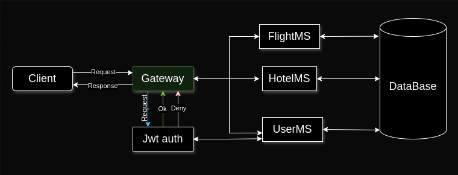
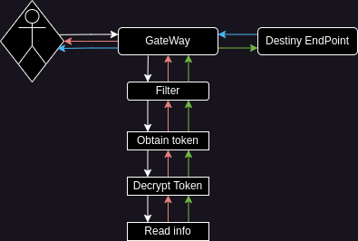
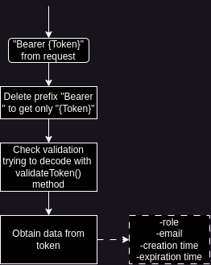

# L-Airline API Rest Project: GateWay Microservice
This microservice management access and authorization to others microservice of L-Airline environment using role-based access control.



It uses JWT implementation to authenticate a user's request based on his role and tokens lifetime.

## Authentication/authorization life cycle

**White arrows**: user's request.  
**Red arrows**: denied.  
**Green arrows**: accepted.  
**Blue arrows**: response.



On a first step, the Client sends a request to a Destiny EndPoint, but GateWay sent the request to a Custom Filter who gets, decrypts and read the generated JWT to permit or deny the request.

## Admins authentication
**You can find in**: ar/com/l_airline/gateway_microservice/filter/AdminFilter.java

```java
public GatewayFilter apply(Config config) {
return ((exchange, chain) -> {
    //Verify a valid token and decrypt
                //This method validate if the user's request has the admin role
                if (!jwt.isAdmin(authenticationHeader)){
                    throw new AccessDeniedException();
                }
    //Other verification
            return chain.filter(exchange);
        });
}
```

The user's authentication does not use the method `jwt.isAdmin(?)`, therefore, use same logic authentication but does not block the request if the user does not have an admin role.

You can check it in ar/com/l_airline/gateway_microservice/filter/UserAndAdminFilter.java

### Not secured endpoints
**You can find in**: ar/com/l_airline/gateway_microservice/filter/RouteValidator.java

To that a client can authenticate and register in the project, we can't demand a JWT, and make public some EndPoints.
- /user/insert
- /auth/token
- /auth/validate
- /eureka

## Setting a filter to a (or more) EndPoint

This can be configured in application.properties with the following structure:
```properties
#This two lines determinate where the predicates (endpoints) will go
spring.cloud.gateway.routes[0].id=example-name
spring.cloud.gateway.routes[0].uri=lb://EXAMPLE-NAME
#Set an EndPoint list to one predicate
spring.cloud.gateway.routes[0].predicates[0]=Path=/example/close, /example/close2
#This is our admin filter that make only admin can access to the endpoints of the above line
spring.cloud.gateway.routes[0].filters[0]=AdminFilter

#This is the same place
spring.cloud.gateway.routes[1].id=example-name
spring.cloud.gateway.routes[1].uri=lb://EXAMPLE-NAME
#In this EndPoints...
spring.cloud.gateway.routes[1].predicates[0]=Path=/example/open, /example/open, /example/open
#... users and admins will be able to access (not no registered users)
spring.cloud.gateway.routes[1].filters[0]=UserAndAdminFilter
```

This configuration has to be set on all EndPoints to secure their access.

## ¿How is the JWT decoded?



- On the first steep we need to delete the prefix "Bearer " from the received token. This will make us able to read and decode the token to pass to the second step; validation.

- Using the secret key, we can decode the Bearer Token because it was made by the same secret key.

- Trying to decode the Bearer Token is a way to know if some malicious client is trying to access with false credentials.

- Now we can have access and read the User Token's data, like email and role. It makes us able to check if the user is authorized to access to one EndPoint.